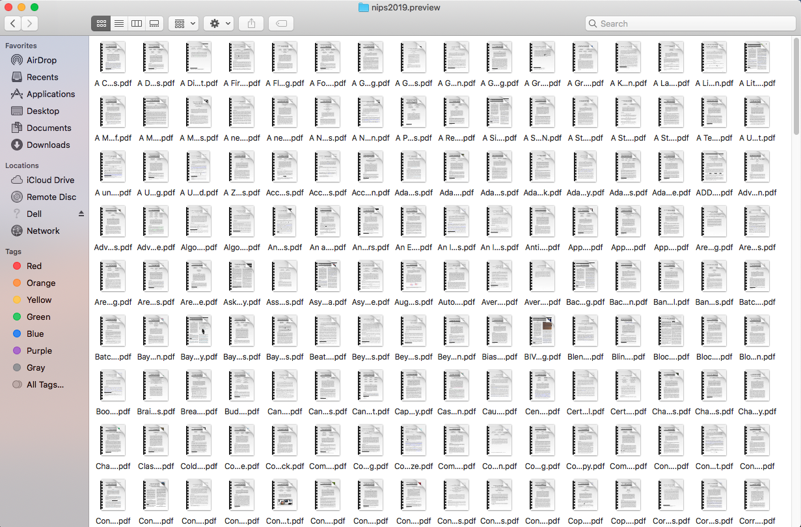

# nips2019.preview
人工智能和机器学习国际顶级会议NeurIPS2019 论文收集 python脚本 以及 论文打包下载

人工智能和机器学习顶级会议NeurIPS 2019公布了接受论文，有效提交论文6743篇论文， 总共有1430接受论文, 21.1%接受率，包括36篇Oral，164篇Spotlights。

会议将于2019年12月8日-14日在加拿大温哥华举办，根据会议公布的接受论文题目，在arxiv.org进行检索收集论文preview版本，使得大家可以提前两个月就能欣赏到大部分NIPS2019论文。

## 太长不看，只要结果，论文打包下载，2019/09/30更新(736/1430)

### 论文下载百度云链接：链接：https://pan.baidu.com/s/1X6yyTmweOmvZ3p99XnJCkg 
提取码：cd9r  文件名:【nips2019.preview.tar.xz】  解压方式：7-zip 

md5sum: 55447b0bef998e1539e29cfb245c09b5

*Last updated: 2019/09/30*

#### Update log
* 2019/09/26 * - 更新710/1430篇文章 
* 2019/09/30 * - 更新736/1430篇文章 改进论文题目相似度

## Table of Contents 一些相关资料

- [NIPS2019 公布的接受论文Accepted Papers 1430 ](https://nips.cc/Conferences/2019/AcceptedPapersInitial)

- [paper.list](script/paper.list)

- [pdf.list](script/pdf.list)

------------------------

本项目服务于三类情况：

- 1.不看程序，只要论文打包下载

- 2.使用检索下载论文脚本get_arxiv.py,

- 3.根据脚本运行的中间结果在ipython中play around

 ***************************************************************************

## 运行get_arxiv.py 复现结果，自己打包

### 极速上手,脚本run起来

### 如何生成 paper.list 文件

### 根据观察改进题目相似度threshold，获得更好的结果

## 在ipython中play around

### 核心表 df_paper

