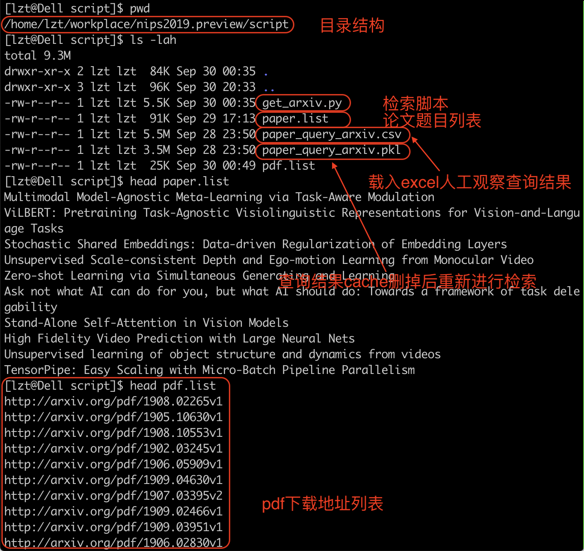
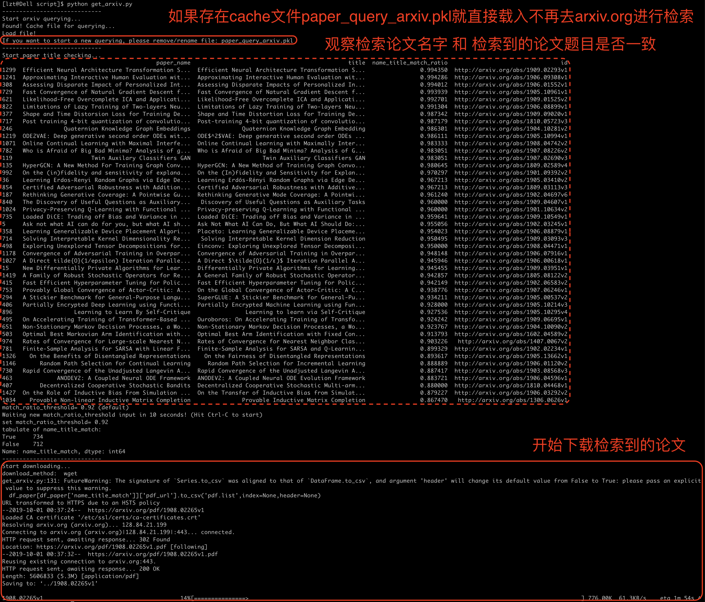
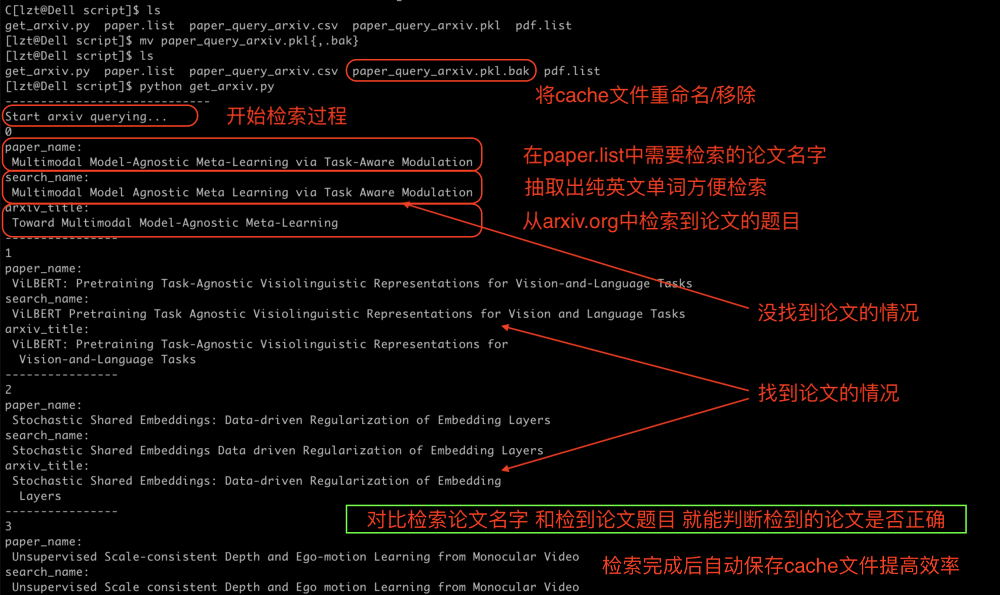
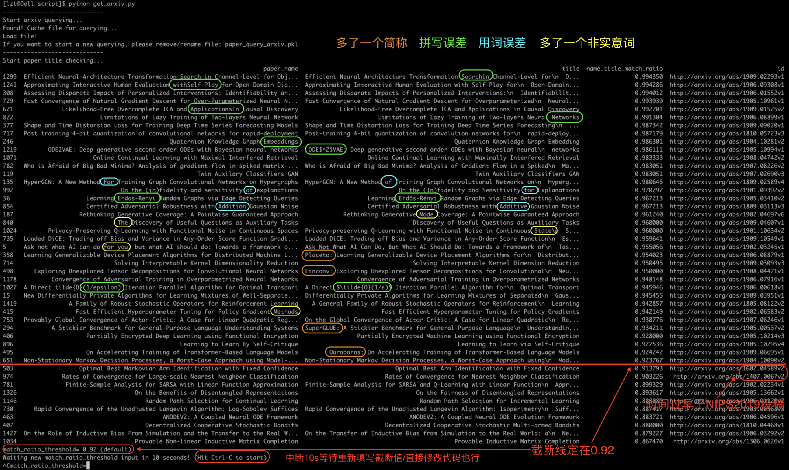
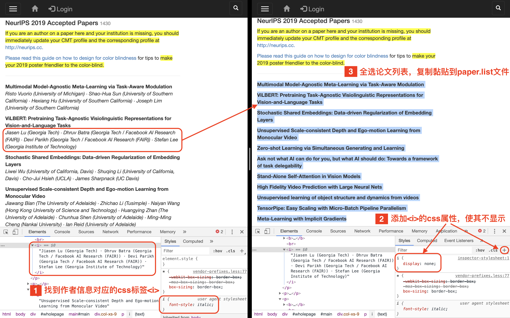
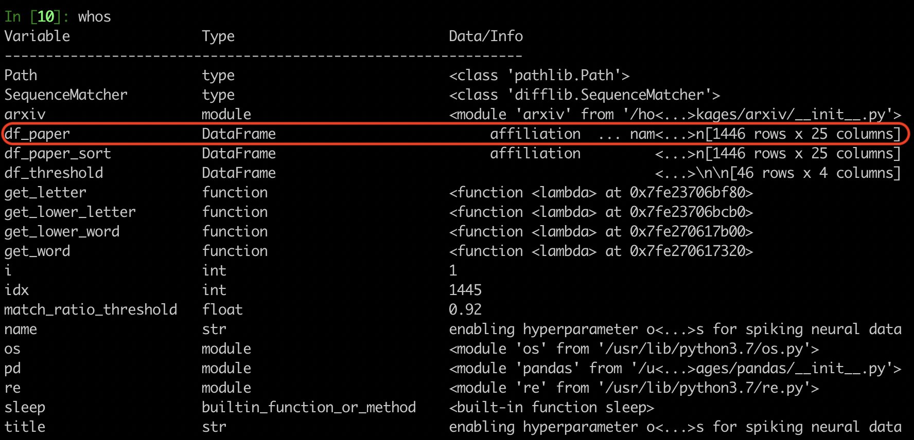
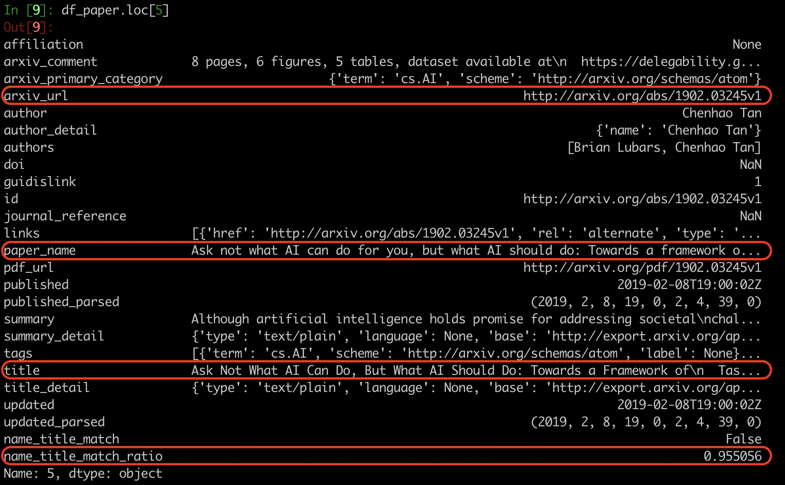

# nips2019.preview
人工智能和机器学习国际顶级会议NeurIPS2019 论文收集 python脚本 以及 论文打包下载

人工智能和机器学习顶级会议NeurIPS 2019公布了接受论文，有效提交论文6743篇论文， 总共有1430接受论文, 21.1%接受率，包括36篇Oral，164篇Spotlights。

会议将于2019年12月8日-14日在加拿大温哥华举办，根据会议公布的接受论文题目，在arxiv.org进行检索收集论文preview版本，使得大家可以提前两个月就能欣赏到大部分NIPS2019论文。

## 🎉 太长不看，只要结果，论文打包下载，2019/09/30更新(736/1430) 🎉 

### 论文下载百度云链接：链接：https://pan.baidu.com/s/1X6yyTmweOmvZ3p99XnJCkg 
提取码：cd9r  文件名:【nips2019.preview.tar.xz】  解压方式：7-zip 

md5sum: 55447b0bef998e1539e29cfb245c09b5

*Last updated: 2019/09/30*

如果喜欢，或者觉得有帮助到你，请点击右上角 ⭐️Star， 帮我加颗星.
#### Update log
* 2019/09/26 * - 更新710/1430篇文章 
* 2019/09/30 * - 更新736/1430篇文章 改进论文题目相似度


## Table of Contents 一些相关资料

- [NIPS2019 公布的接受论文列表Accepted Papers 1430篇(全) ](https://nips.cc/Conferences/2019/AcceptedPapersInitial)

- [接受论文题目列表 paper.list](script/paper.list)  以及[【生成方法】](#%E5%A6%82%E4%BD%95%E7%94%9F%E6%88%90-paperlist-%E6%96%87%E4%BB%B6)

- [在arxiv.org上可以检索的到pdf文件下载地址url列表 pdf.list](script/pdf.list) 以及[【直接使用wget下载方法】](#%E7%9B%B4%E6%8E%A5%E4%BD%BF%E7%94%A8wget%E4%B8%8B%E8%BD%BDpdf%E6%96%87%E4%BB%B6)

------------------------

本项目服务于三类情况：

- 1.不看程序，只要论文打包下载(会定期更新) 🎉

- 2.使用检索下载论文脚本get_arxiv.py ✈️

- 3.根据脚本运行的中间结果在ipython中play around 🚀 


 ***************************************************************************

## ✈️ 运行get_arxiv.py 复现结果，自己打包 ✈️

### 极速上手,脚本run起来
1.下载程序

```bash
git clone https://github.com/lvzongting/nips2019.preview.git
```
2.安装需要的python依赖

```bash
pip install pandas arxiv --user
```
3.运行get_arxiv.py脚本

```bash
cd nips2019.preview/script
python get_arxiv.py
```
4.目录与文件

* 目录结构，在nips2019.preview/script 中运行python get_arxiv.py 会在上一级目录nips2019.preview 中存放所下载的pdf文件
* 将需要作查询query的论文名称，保存在paper.list中，本项目提供的paper.list存放的是nips2019公布的[接受论文Accepted Papers](https://nips.cc/Conferences/2019/AcceptedPapersInitial)
* 项目中提供的[paper_query_arxiv.pkl](script/paper_query_arxiv.pkl) 是2019/09/30所做检索结果的cache，如果打算重新做一遍query，请将这个文件删掉后再运行get_arxiv.py脚本
* 生成的pdf下载地址列表保存在[pdf.list](script/pdf.list) 可以根据这个文件[直接使用wget下载pdf文件](#%E7%9B%B4%E6%8E%A5%E4%BD%BF%E7%94%A8wget%E4%B8%8B%E8%BD%BDpdf%E6%96%87%E4%BB%B6)



5.运行过程



6.去掉cache文件，重新检索arxiv.org过程



### 根据观察改进题目相似度threshold，获得更好的结果

设置相似度threshold，根据如下观察：

* 论文发表时间，不可以 ❌
* 多了一个简称，可以 ✅
* 同义词有拼写误差，可以 ✅
* 用词误差，可以 ✅
* 多了一个非实意词，可以 ✅



### 如何获得 paper.list 文件

通过NIPS2019公布的接受论文列表[Accepted Papers](https://nips.cc/Conferences/2019/AcceptedPapersInitial)
在浏览器DevTools中检查元素模式(Cmd/Ctrl + Shift + C)，临时编辑CSS属性，隐藏显示作者信息，然后批量复制黏贴论文题目保存到paper.list文件



### 直接使用wget下载pdf文件

在pdf.list文件所在目录执行

```bash
wget -c -U definitely-not-wget -P ../ -i pdf.list
```
* -c 断点续传，避免重复下载，如果下载过且完整则跳过，如果下载过不完整则继续下载
* -U definitely-not-wget 指定users-agent 不指定arxiv.org 会报403错误
* -i 指定批量pdf下载地址url的文件，即pdf.list
* -P ../ 指定下载目录，为了方便文件管理，区分脚本和下载下来的pdf文件，指定pdf下载到上一级目录，如果不指定，就在当前目录下载

pdf.list文件大概是这个样子的：

```bash
http://arxiv.org/pdf/1908.02265v1
http://arxiv.org/pdf/1905.10630v1
http://arxiv.org/pdf/1908.10553v1
http://arxiv.org/pdf/1902.03245v1
http://arxiv.org/pdf/1906.05909v1
http://arxiv.org/pdf/1909.04630v1
http://arxiv.org/pdf/1907.03395v2
http://arxiv.org/pdf/1909.02466v1
http://arxiv.org/pdf/1909.03951v1
http://arxiv.org/pdf/1906.02830v1
```
wget 直接下载下来之后文件名就是这样的

```bash
1908.02265v1
1905.10630v1
1908.10553v1
1902.03245v1
1906.05909v1
1909.04630v1
1907.03395v2
1909.02466v1
1909.03951v1
1906.02830v1
```

根据需要，可以进行批量重命名，比如GUI工具[gprename](https://linuxtoy.org/archives/gprename.html)，[krename](https://linuxtoy.org/archives/krename.html)

## 🚀在ipython中play around 🚀

在ipython中执行

```python
%run get_arxiv.py
```
在等待10s的时候，或者开始下载之前ctrl+c 暂停程序回到ipython开始play around

查看内存中的所有变量

```bash
whos 
```


核心变量是pandas的Dataframe表，df_paper

```bash
df_paper.loc[5]
```


常用到的columns有: 
* title: 论文题目
* paper_name: 论文列表名称
* arxiv_url: 下载地址
* name_title_match_ratio: 论文列表名称和论文题目单词相似度

### df_paper的构成


### df_paper的使用


